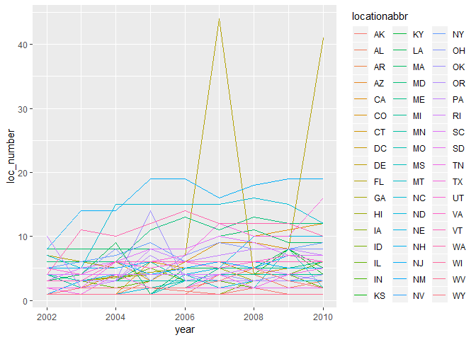
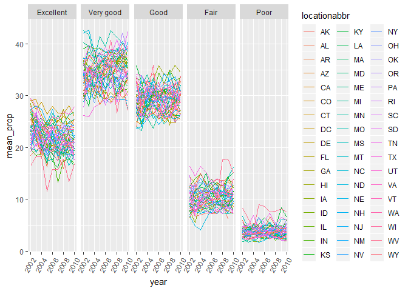
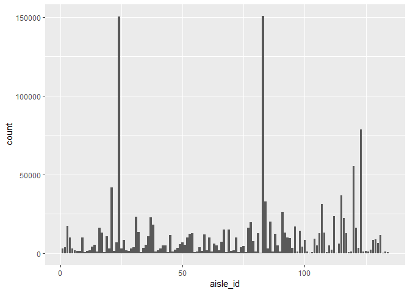
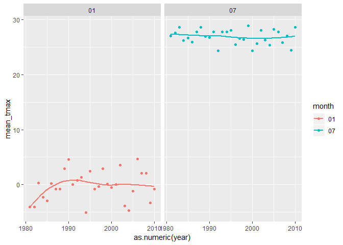
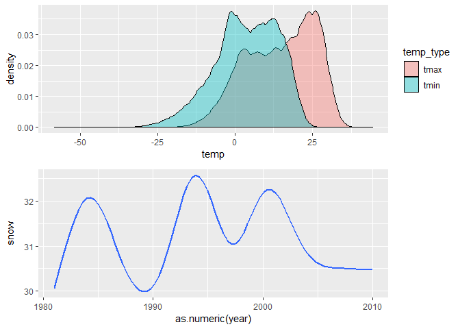

p8105\_hw3\_yl3181
================
Yuelin
October 13, 2018

Problem 1
=========

``` r
library(tidyverse)
```

    ## -- Attaching packages ----------------------------------------------------------------------------- tidyverse 1.2.1 --

    ## v ggplot2 3.0.0     v purrr   0.2.5
    ## v tibble  1.4.2     v dplyr   0.7.6
    ## v tidyr   0.8.1     v stringr 1.3.1
    ## v readr   1.1.1     v forcats 0.3.0

    ## -- Conflicts -------------------------------------------------------------------------------- tidyverse_conflicts() --
    ## x dplyr::filter() masks stats::filter()
    ## x dplyr::lag()    masks stats::lag()

``` r
library(p8105.datasets)

#Import and organize dataset including cleaning names, filter certain obs and change variable type
brfss = janitor::clean_names(brfss_smart2010) %>% 
        filter(topic == "Overall Health") %>% 
        mutate(response = factor(response, levels = c("Excellent","Very good","Good","Fair","Poor")))

#Group datasets by years and locations for following analyses 
loc_count = group_by(brfss,year,locationabbr) %>% 
            distinct(year, locationabbr,locationdesc) %>% 
            summarise(loc_number = n())
```

-   In 2002, states observed at 7 locations is CT, FL, NC; (Comment: This means that the response rate for overall health topics are relatively high in these two states in 2002.)

-   A "spaghetti plot" that shows the number of locations in each state from 2002 to 2010:

``` r
#Spaghetti plot
ggplot(data = loc_count,aes(x = year, y = loc_number, color = locationabbr)) + geom_line()
```



Comment: 1. From the spaghetti plot, we can see that the response rate in Florida is very inconsistent. In 2007 and 2010, the number of locations in FL reached 40 or more, but in other years, the numbers of locations in FL all below 10; 2. In general, New Jersey has relatively more locations with response, especially in recent years; while Alaska has relatively less locations.

-   A table showing, for the years 2002, 2006, and 2010, the mean and standard deviation of the proportion of "Excellent" responses across locations in NY State:

``` r
brfss %>%
  filter(locationabbr == "NY", year %in% c(2002,2006,2010)) %>% 
  group_by(year) %>% 
  filter(response == "Excellent") %>% 
  summarise(mean_prop = mean(data_value),sd_prop = sd(data_value) )
```

    ## # A tibble: 3 x 3
    ##    year mean_prop sd_prop
    ##   <int>     <dbl>   <dbl>
    ## 1  2002      24.0    4.49
    ## 2  2006      22.5    4.00
    ## 3  2010      22.7    3.57

Comment: From the table, we can see that the proportion of excellent response for overall health topics are consistent with all these years (around 0.32), but the variance of the response increases at 2010.

``` r
# Group original data by year, state and response, then calculate the mean of proportions
brfss_group = brfss %>% 
        group_by(year,locationabbr, response) %>% 
        summarize(mean_prop = mean(data_value))

ggplot(brfss_group,aes(x = year, y = mean_prop, color = locationabbr)) + theme(axis.text.x = element_text(angle = 60, hjust = 1)) + geom_line() + facet_grid(~response)
```

    ## Warning: Removed 1 rows containing missing values (geom_path).



Problem 2
=========

``` r
sum_insta = skimr::skim(instacart) %>%
            select(variable:stat,value) %>%
            filter(stat != "hist") %>%
            spread(key = stat,value = value)

knitr::kable(sum_insta)
```

| variable                  | type      |  complete|  empty|  max|          mean|  min|  missing|        n|  n\_unique|   p0|     p100|     p25|      p50|      p75|            sd|
|:--------------------------|:----------|---------:|------:|----:|-------------:|----:|--------:|--------:|----------:|----:|--------:|-------:|--------:|--------:|-------------:|
| add\_to\_cart\_order      | integer   |   1384617|     NA|   NA|  8.758044e+00|   NA|        0|  1384617|         NA|    1|       80|       3|        7|       12|  7.423936e+00|
| aisle                     | character |   1384617|      0|   29|            NA|    3|        0|  1384617|        134|   NA|       NA|      NA|       NA|       NA|            NA|
| aisle\_id                 | integer   |   1384617|     NA|   NA|  7.130423e+01|   NA|        0|  1384617|         NA|    1|      134|      31|       83|      107|  3.810409e+01|
| days\_since\_prior\_order | integer   |   1384617|     NA|   NA|  1.706613e+01|   NA|        0|  1384617|         NA|    0|       30|       7|       15|       30|  1.042642e+01|
| department                | character |   1384617|      0|   15|            NA|    4|        0|  1384617|         21|   NA|       NA|      NA|       NA|       NA|            NA|
| department\_id            | integer   |   1384617|     NA|   NA|  9.839777e+00|   NA|        0|  1384617|         NA|    1|       21|       4|        8|       16|  6.292830e+00|
| eval\_set                 | character |   1384617|      0|    5|            NA|    5|        0|  1384617|          1|   NA|       NA|      NA|       NA|       NA|            NA|
| order\_dow                | integer   |   1384617|     NA|   NA|  2.701392e+00|   NA|        0|  1384617|         NA|    0|        6|       1|        3|        5|  2.167646e+00|
| order\_hour\_of\_day      | integer   |   1384617|     NA|   NA|  1.357759e+01|   NA|        0|  1384617|         NA|    0|       23|      10|       14|       17|  4.238458e+00|
| order\_id                 | integer   |   1384617|     NA|   NA|  1.706298e+06|   NA|        0|  1384617|         NA|    1|  3421070|  843370|  1701880|  2568023|  9.897326e+05|
| order\_number             | integer   |   1384617|     NA|   NA|  1.709141e+01|   NA|        0|  1384617|         NA|    4|      100|       6|       11|       21|  1.661404e+01|
| product\_id               | integer   |   1384617|     NA|   NA|  2.555624e+04|   NA|        0|  1384617|         NA|    1|    49688|   13380|    25298|    37940|  1.412127e+04|
| product\_name             | character |   1384617|      0|  159|            NA|    3|        0|  1384617|      39123|   NA|       NA|      NA|       NA|       NA|            NA|
| reordered                 | integer   |   1384617|     NA|   NA|  5.985944e-01|   NA|        0|  1384617|         NA|    0|        1|       0|        1|        1|  4.901829e-01|
| user\_id                  | integer   |   1384617|     NA|   NA|  1.031128e+05|   NA|        0|  1384617|         NA|    1|   206209|   51732|   102933|   154959|  5.948715e+04|

``` r
#Generate summary to describe types of variables
sum_insta_type = group_by(sum_insta,type) %>% 
                summarise(type_n = n())
```

-   The data structure is data.frame
-   The data includes 1384617 observations and 15 variables;
-   Among all these variables, 4 variables are character, and 11 variables are integer;
-   Some key variables are c("order\_id", "order\_number", "product\_id", "product\_name", "reordered");
-   Some examples of observations are as follows:

|  order\_id|  product\_id|  add\_to\_cart\_order|  reordered|  user\_id| eval\_set |  order\_number|  order\_dow|  order\_hour\_of\_day|  days\_since\_prior\_order| product\_name                                 |  aisle\_id|  department\_id| aisle                | department |
|----------:|------------:|---------------------:|----------:|---------:|:----------|--------------:|-----------:|---------------------:|--------------------------:|:----------------------------------------------|----------:|---------------:|:---------------------|:-----------|
|          1|        49302|                     1|          1|    112108| train     |              4|           4|                    10|                          9| Bulgarian Yogurt                              |        120|              16| yogurt               | dairy eggs |
|          1|        11109|                     2|          1|    112108| train     |              4|           4|                    10|                          9| Organic 4% Milk Fat Whole Milk Cottage Cheese |        108|              16| other creams cheeses | dairy eggs |
|          1|        10246|                     3|          0|    112108| train     |              4|           4|                    10|                          9| Organic Celery Hearts                         |         83|               4| fresh vegetables     | produce    |

Answering questions:

``` r
# Grouped data by aisle and generate total count of observations for the first question
group_insta_aisle = group_by(instacart,aisle) %>% 
                    summarise(n = n()) %>% 
                    arrange(desc(n))
```

-   How many aisles are there: 134. Which aisles are the most items ordered from: fresh vegetables (Comment: Among all the 134 aisles, fresh vegetables is the top-selling aisle.)

-   Make a plot that shows the number of items ordered in each aisle. Order aisles sensibly, and organize your plot so others can read it.

``` r
ggplot(instacart,aes(x = aisle_id)) + geom_bar()
```



Comment: As we can see, orders for fresh vegetable and fresh fruits are far more than other aisles.

-   Make a table showing the most popular item in each of the aisles "baking ingredients", "dog food care", and "packaged vegetables fruits".

``` r
# Grouped data by aisle and items, and generate total count of observations
instacart %>% 
  filter(aisle %in% c("baking ingredients", "dog food care", "packaged vegetables fruits")) %>% 
  group_by(aisle,product_name) %>% 
  summarise(item_n = n()) %>% 
  filter(min_rank(desc(item_n))==1)
```

    ## # A tibble: 3 x 3
    ## # Groups:   aisle [3]
    ##   aisle                    product_name                             item_n
    ##   <chr>                    <chr>                                     <int>
    ## 1 baking ingredients       Light Brown Sugar                           499
    ## 2 dog food care            Snack Sticks Chicken & Rice Recipe Dog ~     30
    ## 3 packaged vegetables fru~ Organic Baby Spinach                       9784

Comment: For baking ingredients, Light Brown Sugar is trending; For dog food care, Snack Sticks Chicken & Rice Recipe Dog Treats is trending; For packaged vegetables fruits, Organic Baby Spinach is trending.

-   Make a table showing the mean hour of the day at which Pink Lady Apples and Coffee Ice Cream are ordered on each day of the week.

``` r
# Grouped data by aisle and items, and generate total count of observations
# Note: product such as "Bag Pink Lady Apples" or "Large Pink Lady Apples" are not included because they might refer to different products instead of "Pink Lady Apples".
instacart %>% 
  filter(product_name %in% c("Pink Lady Apples", "Coffee Ice Cream")) %>% 
  group_by(product_name,order_dow) %>% 
  summarise(mean_hour = mean(order_hour_of_day)) %>% 
  mutate(order_dow = factor(order_dow, levels = rep(0:6)), order_dow = recode(order_dow, "0" = "Sunday", "1" = "Monday", "2" = "Tuesday", "3" = "Wednesday", "4" = "Thursday", "5" = "Friday", "6" = "Saturday")) %>% 
  spread(key = order_dow, value = mean_hour)
```

    ## # A tibble: 2 x 8
    ## # Groups:   product_name [2]
    ##   product_name     Sunday Monday Tuesday Wednesday Thursday Friday Saturday
    ##   <chr>             <dbl>  <dbl>   <dbl>     <dbl>    <dbl>  <dbl>    <dbl>
    ## 1 Coffee Ice Cream   13.8   14.3    15.4      15.3     15.2   12.3     13.8
    ## 2 Pink Lady Apples   13.4   11.4    11.7      14.2     11.6   12.8     11.9

Comment: In general, people tends to place order around noon. On Wednesday, people tends to place order at 2PM.

Problem 3
=========

Data summary:

-   The data structure is data.frame
-   The data includes 2595176 observations and 7 variables;
-   Some key variables are date, prcp, snow, tmax, tmin;
-   Some examples of observations are as follows:

| id          | date       |  prcp|  snow|  snwd| tmax | tmin |
|:------------|:-----------|-----:|-----:|-----:|:-----|:-----|
| USW00094789 | 1997-12-20 |     0|     0|     0| 100  | 17   |
| USW00094789 | 1997-12-21 |     0|     0|     0| 39   | -33  |
| USW00094789 | 1997-12-22 |    30|     3|     0| 28   | -50  |
| USW00094789 | 1997-12-23 |   150|     0|     0| 39   | 22   |

``` r
#Create separate variables for year, month, and day. Change temperature, precipitation, and snowfall into reasonable units. 
clean_ny_noaa = ny_noaa %>% 
  na.omit() %>% 
  separate(date, into = c("year","month","day"), sep = "-") %>% 
  mutate(prcp = prcp/10, tmax = as.numeric(tmax)/10, tmin = as.numeric(tmin)/10)

# Generate mode for snow
mode_snow = group_by(clean_ny_noaa, snow) %>% 
  summarise(n = n()) %>% 
  filter(min_rank(desc(n))==1)
```

-   The most commonly observed value for snowfall is 0 (Comment: As we can see, most of the times, new york don't have snowfall.)

-   Make a two-panel plot showing the average max temperature in January and in July in each station across years.

``` r
# Generate grouped average tmax for Jan and Jul. Month, year and day remained character variables deliberately. 
noaa_tmax_mean = clean_ny_noaa %>% 
                filter(month == c("01","07")) %>% 
                group_by(year,month) %>% 
                summarise(mean_tmax = mean(tmax)) 
```

    ## Warning in month == c("01", "07"): longer object length is not a multiple
    ## of shorter object length

``` r
ggplot(noaa_tmax_mean, aes(x = as.numeric(year), y = mean_tmax, color = month)) + geom_point() + geom_smooth(se = FALSE) + facet_grid(~month)
```

    ## `geom_smooth()` using method = 'loess' and formula 'y ~ x'



-   Is there any observable / interpretable structure: As we can see, in new york, the average maximum temperature in July is relatively stable around 27 centigrade through all these decades; while the maximum temperature in January drastically increased for 5 centigrade during 1980 to 1990, and was relatively stable ever after.

-   Outliers for mean maximum temperature in new york:

January outliers:

    ## # A tibble: 4 x 3
    ## # Groups:   year [4]
    ##   year  month mean_tmax
    ##   <chr> <chr>     <dbl>
    ## 1 1990  01         4.53
    ## 2 1994  01        -5.07
    ## 3 2004  01        -4.76
    ## 4 2006  01         4.69

July outliers:

    ## # A tibble: 3 x 3
    ## # Groups:   year [3]
    ##   year  month mean_tmax
    ##   <chr> <chr>     <dbl>
    ## 1 1992  07         24.3
    ## 2 2000  07         24.4
    ## 3 2009  07         24.4

Comment: As we can see, there are more outliers in January than July, indicating that the average maximum temperature is more irregular in January than in July.

-   Make a two-panel plot showing (i) tmax vs tmin for the full dataset; (ii) make a plot showing the distribution of snowfall values greater than 0 and less than 100 separately by year.

``` r
#Make the first plot: tmax vs. tmin
temp_plot = clean_ny_noaa %>% 
            gather(key = temp_type, value = temp, tmax:tmin) %>% 
            ggplot(aes(x = temp, fill = temp_type)) + geom_density(alpha = .4)
#Make the second plot: snowfall (within (0,100)) distribution with years
snow_plot = clean_ny_noaa %>% 
            filter(snow > 0 & snow < 100) %>% 
            ggplot(aes(x = as.numeric(year), y = snow)) + geom_smooth(se = FALSE)

#Combine plots
library(patchwork)
temp_plot / snow_plot
```

    ## `geom_smooth()` using method = 'gam' and formula 'y ~ s(x, bs = "cs")'



Comment: For the first plot, we can see that the distribution for maximum temperature and minimum temperature are similar, but the maximum temperature are greater than the minimal one; for the seond plot, we can see that the snowfall follows a cycle, and will reach a peak once every few years. However, in the recent years, the peak seems to disappear, which might indicate the effect of global warming.
